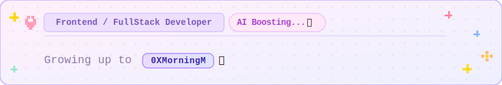

# Hi, Call me MorningM. ☕️

---

## 🛠 Tech Stack

         

---

## 🚀 Featured Projects

### 🤖 AI Native + FullStack

**[ClawPiggy](https://github.com/OasAIStudio/ClawPiggy)** — P2P token recycling network for AI Agents. Put unused tokens into a piggy bank, then cashing them out as help when you need it.

**[ClawCareer](https://github.com/Aubrey-M-ops/ClawCareer)** — Automated job search bot. Monitors LinkedIn by custom filters and delivers daily matches to Telegram.

### ☁️ Cloud Computing

**[Middleware Platform for Cloud-Edge Computing](https://github.com/Aubrey-M-ops/Middleware_Platform_for_Cloud_Edge_Computing)** — Unified middleware for heterogeneous cloud and edge deployments, with automatic resource discovery and ML-driven predictive scheduling.

---

## 📫 How to reach me

📧 limohan.dev@gmail.com
